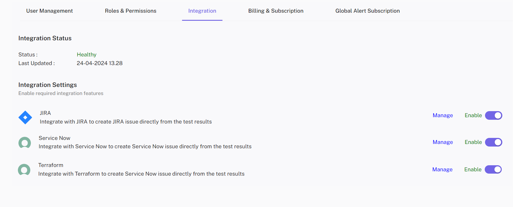

## Overview 
CloudPi offers robust integration capabilities with leading workflow management tools such 
as ServiceNow and Jira. This integration is designed to streamline cloud management 
processes, enhance team collaboration, and improve the tracking and resolution of cloud related tasks and issues. By integrating these tools, CloudPi helps ensure that all activities 
are logged, tracked, and managed efficiently, promoting accountability and responsibility 
within teams. 

## Key Features 
 
###Integration with ServiceNow and Jira
- Seamless Connectivity: CloudPi supports integration with ServiceNow and Jira, allowing for 
the seamless flow of information and tasks between CloudPi and these popular workflow 
platforms. 
- Ticket Management: Utilize these tools to raise, assign, and track tickets. This system 
ensures that each team member knows their responsibilities and that tickets are addressed 
in a timely manner, enhancing the responsiveness of IT teams to operational needs. 
 
### Setup and Configuration
- Accessible via Workspace Settings: Administrators can easily set up and configure the 
integration with ServiceNow and Jira directly from the CloudPi workspace settings. This 
centralized access simplifies the setup process and allows for quick adjustments as 
organizational workflows evolve. 
 
### Responsibility and Accountability
- Clear Task Assignment: By raising tickets for specific tasks or issues within ServiceNow or 
Jira, team members receive clear assignments, which helps delineate responsibilities and 
ensures accountability. 
- Timely Review and Resolution: The integration helps ensure that all issues are reviewed 
and addressed promptly. Automated reminders and escalation paths within these tools help 
keep tasks on track and prevent oversights. 
 
### Benefits 
- Enhanced Operational Efficiency: Streamline your cloud management processes by 
integrating CloudPi with your existing workflow tools, reducing manual efforts and 
improving response times. 
- Improved Team Collaboration: Facilitate better communication and collaboration among 
team members by using a unified system for managing tasks and issues related to cloud 
operations. 
- Increased Accountability: With clear tracking and assignment of tasks, team members are 
more accountable for their work, leading to higher productivity and more efficient problem 
resolution. 
 
### Navigating the Integration 
 
- Accessing Integration Settings: Log into CloudPi, navigate to the workspace settings, and 
select the 'Integrations' tab. Here, you can link your CloudPi environment with ServiceNow 
and Jira. 
- Configuring the Tools: Follow the prompts to enter the necessary configuration details 
such as API keys, user credentials, and project or workspace IDs. This setup ensures that 
CloudPi can communicate effectively with ServiceNow and Jira. 
- Using the Integration: Once set up, users can start raising tickets directly from within 
CloudPi. These tickets will automatically populate in the linked ServiceNow or Jira project, 
where they can be managed according to the usual workflow processes. 
- Monitoring and Adjustments: Regularly check the integration status and performance 
within CloudPi. Make adjustments to configurations as needed to adapt to new workflows 
or changes in team structure. 
 
 
CloudPi’s integration with workflow tools like ServiceNow and Jira empowers organizations 
to leverage their existing IT service management frameworks to enhance cloud operations, 
ensuring tasks are handled efficiently and effectively, thus driving better cloud governance 
and operational agility.

