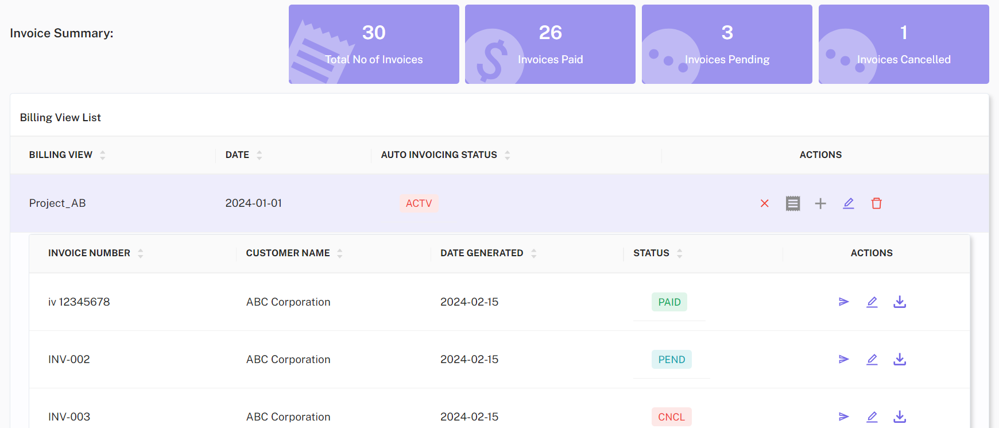

Welcome to your central billing command center! The CloudPi Multi-Cloud Billing Hub offers a comprehensive solution for managing and analyzing billing data across various Cloud Service Providers (CSPs). This hub allows you to create tailored 'BillingViews' to monitor expenditures based on different dimensions like services, service groups, and user-defined cost tags.  

## Key Features 

- **Customizable Billing Views**: Easily configure views based on specific dimensions to better understand your cloud expenses. 

- **Invoice Customization and Delivery**: Customize and automatically generate invoices tailored to your organizational needs and have them delivered seamlessly. 

- **Managed Cloud Services Provider Support**: Receive specialized billing services designed for Managed Cloud Service Providers. 

- **CUDS/Savings Plans Management**: Efficiently manage your commitments and savings plans to optimize financial performance. 

## How to Navigate 

Upon accessing the Multi-Cloud Billing Hub, you'll find the following options: 

- **Billing Views Page**: Customize and edit your Billing Views for different analysis perspectives. 

- **Invoice Management**: Access and customize your invoice settings, including setup for auto-generation and delivery. 

- **CUDS/Discounts Dashboard**: View and manage your existing CUDS/Discounts Plans to ensure you are maximizing your savings. 

This user-friendly hub simplifies your multi-cloud billing management by centralizing and streamlining processes, making it easier to monitor and optimize your cloud investments. 

## Navigating Billing Views Page

The billing dashboard provides a comprehensive view of your billing details, including billing view, Account ID, Granularity, project, group by and date range. You can select from dropdowns and apply changes, and save the billing view by entering a name. You can toggle between Table View and Graphical View to better understand your billing data. 

  

   {: width="500"}

<!-- ### Choose Billing View: 
 Create a billing view or choose billing view from the dropdown. 

Create a billing view: you can choose the filters and view the table with the details according to the filters selected. Click on “save the billing view” button, a pop-up will appear, enter a name for your billing view and click on “Save” button. 

  

Choose from the list of billing views: you can view the billing view that was previously created. 

 

### Date Range
You can select the date range for the billing information you want to display by using the date picker at the top right corner of the page. 

 

### Apply Cost Group
To apply a cost group to your expenses, click on the “Apply Cost Group” button. A popup will appear where you can enter your Cost Shared Tag and Cost Group Tag. After entering the tags, click “Apply” to assign the cost groups to your selected items. 

 

 

### Generate Invoices
To generate an invoice based on the displayed billing information, Click the “Generate Invoice” button at the bottom right of the billing summary. This will create a downloadable invoice including all the details from the billing summary. 

 

Switch to Graphical View by toggling the button at the top of the billing page. This view presents your expenses in a bar graph, giving you a visual representation of your spending over the year. 

 

  -->

 

## Invoicing 

The Invoicing page in CloudPi centralizes and streamlines the invoicing process, making it easier for users to generate, manage, and review invoices based on comprehensive and customizable billing views. This feature ensures precise financial management across various customers and cost centers, tailored to the unique demands of multi-cloud environments. 

Key Features  

Invoicing Based on Billing Views: 

- Customization: 
Create invoices that reflect the specific cost structures and categories defined in your billing views, such as services, service groups, or user-defined cost tags. 

- Accuracy: 
Ensure that each invoice accurately represents the consumption and costs as per the configurations set in the billing views, enhancing transparency and accountability. 

Invoicing History: 

- Comprehensive List: 
Access a detailed list of all past invoices, which includes vital information such as invoice dates, amounts, and associated customer or cost center details. 

- Ease of Management: 
Track and manage invoicing records effortlessly, with options to search, filter, and retrieve past invoices based on various criteria, facilitating better financial oversight. 

Invoicing Automation: 

- Scheduled Billing: 
Automate the invoicing process based on selected billing views with customizable schedules (e.g., weekly, monthly). This automation helps maintain consistency in billing cycles and reduces manual workload. 

- Reliability: 
Automate recurring invoices, ensuring they are generated and dispatched at regular intervals without fail, thus improving efficiency and reducing the chances of human error. 

Invoice Customer/Cost Center Details: 

- Detailed Record-Keeping: 
Maintain and manage detailed records for each customer or cost center, including specific billing information and contact details. This information is critical for ensuring invoices are accurate and are sent to the correct recipients. 

- Customization and Control: 
Customize the level of detail shown on invoices for each customer or cost center, allowing for flexibility and specificity in billing practices to meet diverse needs. 

 

## Navigating Invoicing Page

- Access and Setup: Navigate to the invoicing page from the billing page in left navigation menu. Here, you can configure or modify billing views and set up automation for recurring billing cycles.  

- Generate Invoices: Select the appropriate billing view and input any required details to generate an invoice. You can preview the invoice before finalization to ensure all details are correct.  

- Manage and Review: Use the invoicing history section to monitor previously issued invoices, making use of filters to sort and access specific invoices quickly. This section also allows for the reissuing, editing, or cancellation of invoices if necessary.   

**Invoice History**: Here you can view all created billing views.  

 

<!-- **Customer Details**: it shows the relevant information about the customer associated with the billing views. It includes the customer's name, project name, cost center, department name, and the date range for the invoice. 

  -->

 **View Invoices**: view invoices that have been generated under each billing view. You can resend, edit and download invoices.

 **Auto Invoicing**: To enable auto invoicing for a customer, click on auto invoicing icon under actions. In the pop-up window, select the customer from the dropdown menu. Enter the customer’s email ID, set a schedule for the invoicing, specify delivery details such as email id and end date and click on “Save” to enable auto invoicing. 

 {: width="500"}

<!-- **Creating Customer Details**: click on create icon under actions. A popup appears, choose the Customer and Billing view and then click on “Save” button.  -->
**Add Customer**: click on add icon under actions. A popup appears, choose the Customer or create customer details and then click on “Save” button.

 {: width="500"}

On clicking create customer details, you will be navigated to the customer details page to enter details such as first name, last name, email, phone number, address, city, state, cost center, project name and department name, then click on “Save” button. 

 **Editing billing view**: click on the edit icon under the actions to modify billing view . You will be navigated to billing management, where you can edit billing details, including billing view, Account ID, Granularity, project, group by and date range. You can select from dropdowns and apply changes, and save the billing view by entering a name.

