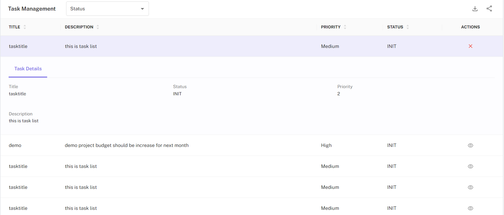

<!-- ## Team Collaboration -->
<!--  -->
## Task Management

CloudPi enhances team productivity with its integrated task management capabilities. You can create, assign, and track tasks within the platform, ensuring effective task resolution and closures. This feature allows teams to stay organized and on top of their cloud management duties seamlessly.

## Tickets with Third-Party Workflow Tools

CloudPi supports integrations with leading third-party workflow tools like Jira and ServiceNow. This enables you to create and manage tickets directly from CloudPi, facilitating smooth transitions between cloud management and broader IT service management frameworks.

## Sharing and Downloading Capabilities

Effortlessly share billing reports, inventory, and other crucial documents with team members within CloudPi. Also, you can download these documents for offline analysis or distribution, enhancing flexibility in how data is accessed and shared.

## Notifications

Stay informed with real-time updates:

- **In-App Notifications:** Receive notifications directly within the CloudPi platform, keeping you updated on task progress, billing anomalies, budget alerts or other critical alerts.

- **Email Notifications:** Opt-in for email notifications to ensure you never miss out on important updates, even when you're not logged into the platform.

These collaboration tools in CloudPi are designed to streamline communication and workflow efficiency, making it easier for teams to manage their multi-cloud environments effectively.

## How to Navigate Collaboration Features: 

### Task Management:  

You will see a list of tasks created for cost optimization activities. Each task entry includes details such as task title, status, description, and actions such as view and delete. You can also filter the table based on status. 

### Ticketing:  

You will see a list of tickets created for cost optimization activities. Each entry includes details such as title, status, description, and actions such as view and delete. You can also filter the table based on status and submit to, where u can filter based on service now or JIRA. 

